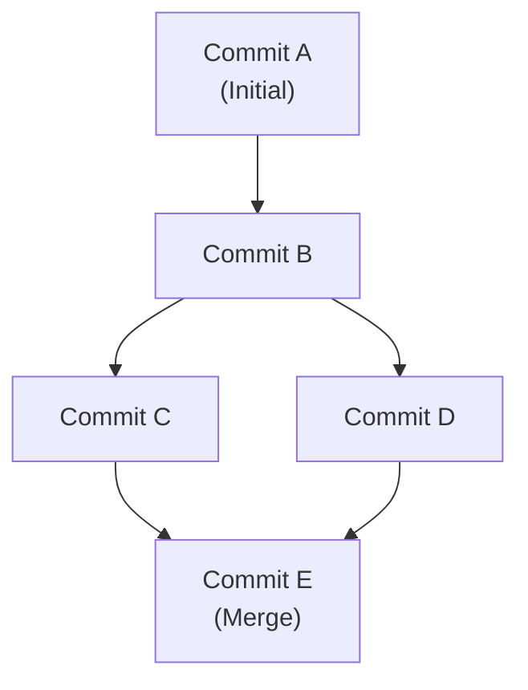
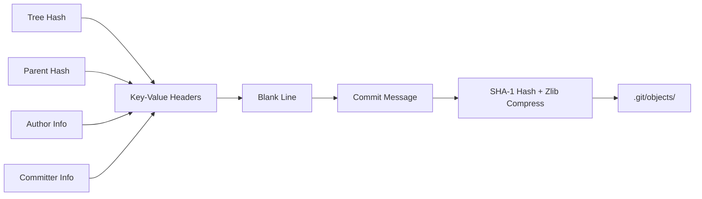

<div align="center">


# Git-rs

### Demystifying Version Control from First Principles

*A from-scratch implementation of Git's core object storage engine in Rust.*

<p align="center">
  <a href="https://skillicons.dev">
    
  </a>
</p>

<p align="center">
  
  
</p>

[](https://github.com/fadyphil/git-rs/actions/workflows/ci.yml)

[Overview](#overview) • [Architecture](#architecture) • [Quick Start](#quick-start) • [Roadmap](#roadmap)

</div>

---

<a id="overview"></a>

## 📖 Overview

`git-rs` is not intended to replace Git. It is a surgical exploration of how version control actually works at the byte level.

By building Git's content-addressable storage, SHA-1 hashing, Zlib compression, and recursive tree serialization from first principles, this project strips away the magic and exposes the raw systems engineering underneath. It is a learning vehicle for mastering Rust's ownership model, binary serialization protocols, and Directed Acyclic Graph (DAG) traversal.

> **The North Star:** If the official, Linus Torvalds-authored Git binary can read, parse, and verify the objects created by `git-rs`, the implementation is correct.

---

<a id="features"></a>

## ✅ Implemented Features

| Command | Description | Engineering Concepts Mastered |
| :--- | :--- | :--- |
| `init` | Creates the `.git/` directory skeleton and `HEAD` pointer, and repo-local `.git/config` file | Filesystem I/O, Path resolution |
| `hash-object -w <file>` | Reads a file, constructs the Git blob format, computes SHA-1, compresses with Zlib, and stores it. | Byte buffers (`Vec<u8>`), Cryptographic hashing, Zlib streams |
| `cat-file <-p\|-t\|-s> <hash>` | Locates, decompresses, parses, and displays stored objects. | Binary parsing, Null-byte delimiters, UTF-8 coercion |
| `write-tree` | Snapshots the current directory into a binary tree object. | **Post-order DFS recursion**, Binary serialization, Raw 20-byte hashing |
| `commit-tree <tree-hash> -m <message>` | Creates a commit object with author/committer signatures and parent references. | **Commit object format**, Signature serialization, DAG parent linking |
| `commit -m <message>` | Porcelain commit: resolve `HEAD`, snapshot working directory into a tree, create a commit with correct parent, and update the current ref. | **Plumbing vs porcelain**, Refs (`HEAD`/`refs/heads/*`), Branch tip mutation |

---

<a id="architecture"></a>

## 🛠️ Architecture & Design

### The Byte-Level Contract

Git does not use JSON, XML, or high-level abstractions. It relies on a strict, continuous stream of bytes. `git-rs` respects this contract exactly:

```text
┌────────────────────────────────────────────────────────────┐
│  THE GIT OBJECT CONTRACT (In RAM before Zlib Compression)  │
├────────────────────────────────────────────────────────────┤
│  [ HEADER ]                                                │
│  "tree 74\0"  ◄── ASCII Text + Null Terminator             │
│                                                            │
│  [ BINARY PAYLOAD ]                                        │
│  "100644 README.md\0" + [20 Raw SHA-1 Bytes]               │
│  "040000 src\0"       + [20 Raw SHA-1 Bytes]               │
└────────────────────────────────────────────────────────────┘
```

### Commit Object Format

Commit objects use a human-readable ASCII format with key-value headers:

```text
┌────────────────────────────────────────────────────────────┐
│  COMMIT OBJECT (ASCII text, not binary)                    │
├────────────────────────────────────────────────────────────┤
│  tree <tree-hash>\n                                        │
│  parent <parent-hash>\n        (optional, for merge commits)│
│  author <name> <<email>> <timestamp> <timezone>\n           │
│  committer <name> <<email>> <timestamp> <timezone>\n        │
│  \n                                                         │
│  <commit message>\n                                         │
└────────────────────────────────────────────────────────────┘
```

### Core Systems Concepts

* **Content-Addressable Storage:** Every object is stored as `.git/objects/XX/YYY...` where `XX` is the first 2 hex chars of the SHA-1 hash. Deduplication is achieved by mathematical certainty, not heuristics.

* **Post-Order DAG Traversal:** Because a parent directory's hash is mathematically derived from its children, `write-tree` utilizes recursive post-order Depth-First Search to bubble hashes up the call stack.

* **Strict Format Compliance:** Objects are stored exactly as official Git expects: `"<type> <size>\0<content>"`, Zlib-compressed, and hashed *before* compression.

* **Rust-Native Memory Model:**

  * Explicit ownership.

  * `&[u8]` slice borrowing.
  
  * `Result`-based error propagation
  
  * `Box<dyn Error>` for unified failure handling.
  
  * No garbage collection, no hidden allocations.

  * `write!`:Zero-allocation byte formatting using the write! macro directly into `Vec<u8>` buffers.

---

## 📦 Dependencies

To enforce a deep understanding of the standard library, external dependencies are strictly limited to the bare minimum required for cryptography and compression:

```toml
[dependencies]
sha1 = "0.10"    # Cryptographic hashing
flate2 = "1.0"   # Zlib compression/decompression
hex = "0.4"      # Hex encoding utilities
serde  = {version = "1.0", features = ["derive"]}
toml = "1.1.2+spec-1.1.0"
```

---

<a id="quick-start"></a>

## 🚀 Quick Start

```bash
# Clone and build the project
git clone <repo-url> && cd git-rs
cargo build --release

# Initialize a test repository
mkdir test-repo && cd test-repo
../target/release/git-rs init

# Store a file
echo "Hello Git Internals" > test.txt
../target/release/git-rs hash-object -w test.txt
# → b6fc4c620b67d95f953a5c1c1230aaab5db5a1b0

# Snapshot the directory
../target/release/git-rs write-tree
# → 4b825dc642cb6eb9a060e54bf8d69288fbee4904

# Create a commit from the tree
../target/release/git-rs commit-tree <tree-hash> -m "Initial commit"
# → 9c5a8c9e8c9e8c9e8c9e8c9e8c9e8c9e8c9e8c9e
```

---

## 🔍 Verification & Interoperability

Every phase is verified against the official `git` CLI. The ultimate test of interoperability:

```bash
# Read a tree object created by git-rs using the official Git binary
git cat-file -p <tree-hash>

# Expected Output:
# 100644 blob b6fc4c...    test.txt

# Verify a commit object created by git-rs
git cat-file -p <commit-hash>

# Expected Output:
# tree 4b825dc642cb6eb9a060e54bf8d69288fbee4904
# author Fady <fady@test.com> 1718000000 +0000
# committer Fady <fady@test.com> 1718000000 +0000
#
# Initial commit
```

If official Git can read the database, the binary format is mathematically correct.

---

<a id="roadmap"></a>

## 📚 Documentation

| Document | Phase | Description |
| ---------- | ------- | ------------- |
| [Git Internals](docs/01_git_internals.md) | 1–3 | Content-addressable storage, blob/tree objects, binary serialization |
| [Engineering Journal](docs/02_engineering_journal.md) | 1–3 | Development log: decisions, trade-offs, and lessons learned |
| [Lessons Learned](docs/03_lessons_learned.md) | 1–3 | Key takeaways from implementing Git's object model |
| [Build Git in Rust Guide](docs/build-git-in-rust.md) | 1–3 | Step-by-step guide for building Git from scratch in Rust |
| [Architecture Documentation](docs/phase-3-docs/Git_RS_Architecture_Documentation.md) | 3 | Visual guides to the Git object model, DAG, and write-tree algorithm |
| [**Commit Objects & the DAG**](docs/04_commit_object_and_commit_tree.md) | **4** | **Commit object format, DAG structure, parent references, and serialization** |
| [**DAG & Commit Serialization**](docs/05_dag_and_commit_serialization.md) | **4** | **Deep dive: DAG mathematics, commit serialization pipeline, content deduplication** |
| [**Porcelain Commit & Refs**](docs/06_porcelain_commit_and_refs.md) | **5** | **`commit` workflow, `HEAD` resolution, branch pointer mutation, plumbing vs porcelain** |

---

## 🗺️ Roadmap

| Phase | Feature | Status |
| :--- | :--- | :--- |
| **1** | `init` & `.git/` structure | ✅ **Complete** |
| **2** | `hash-object`, `cat-file` & object storage | ✅ **Complete** |
| **3** | `write-tree` & binary serialization | ✅ **Complete** |
| **4** | `commit-tree` & DAG parent references | ✅ **Complete** |
| **5** | `commit` workflow & `refs/HEAD` management | ✅ **Complete** |
| **6** | `export-snapshot` & LLM Wiki integration | 🔲 Planned |

---

## 📚 Project Structure

```text
src/
├── main.rs          # CLI dispatcher, argument routing, and command execution
├── object.rs        # SHA-1 hashing, Zlib compression, read/write objects
├── tree.rs          # Recursive directory walking, binary tree serialization
├── commit.rs        # Commit creation, signature serialization, DAG parent linking
├── store.rs         # Object database read/write abstraction
└── refs.rs          # HEAD pointer, branch reference read/write

### Mermaid Diagrams

Throughout the documentation, Mermaid diagrams are used to visualize Git's internal structures and data flow. These diagrams are rendered natively by GitHub when viewing the markdown files.

```

**Example — DAG Structure:**



**Example — Commit Object Format:**



---

---

## 🧠 Learning Objectives

This project is a deliberate exercise in systems programming:

1. **Memory & Ownership:** Master Rust's borrow checker, `&[u8]` slices, and zero-copy parsing.
2. **Binary Protocols:** Implement strict serialization (null-byte separators, raw 20-byte hashes vs 40-char hex strings).
3. **Graph Theory:** Understand how Directed Acyclic Graphs (DAGs) enforce history integrity and enable deduplication. Commit objects form the vertices of the DAG, with parent references creating the edges.
4. **CLI Architecture:** Build a production-grade dispatcher with strict argument validation and clean error propagation.

---

<div align="center">

*Built following the [Build Git From Scratch in Rust](docs/build-git-in-rust.md) blueprint.*

**Documentation:** [Phase 4 — Commit Objects & DAG](docs/04_commit_object_and_commit_tree.md) · [Phase 4 — DAG Deep Dive](docs/05_dag_and_commit_serialization.md) · [Phase 5 — Porcelain Commit & Refs](docs/06_porcelain_commit_and_refs.md)

*This project is a learning vehicle for systems programming. Not intended for production use.*

</div>
