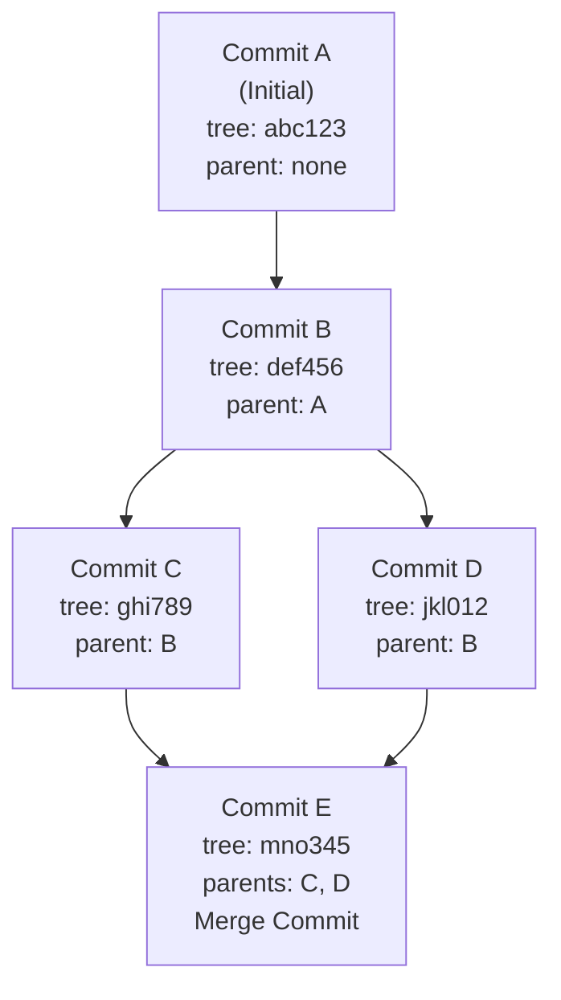
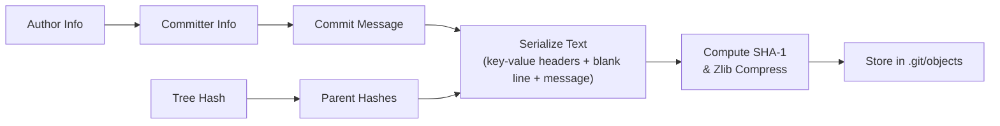
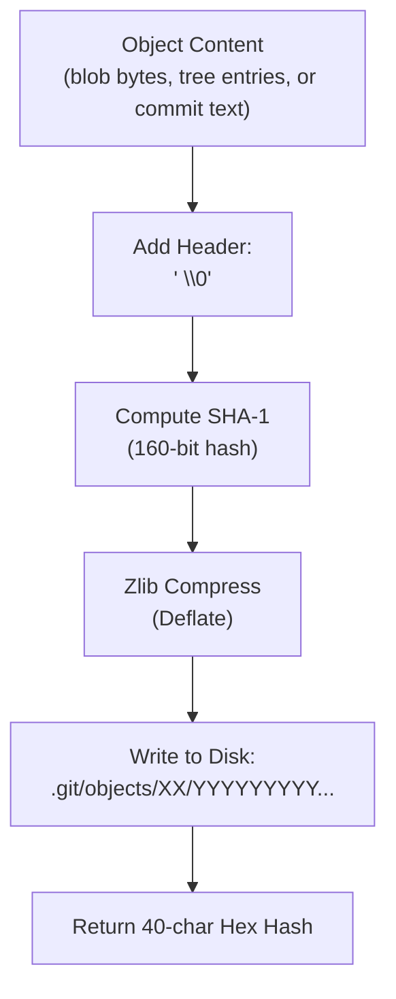
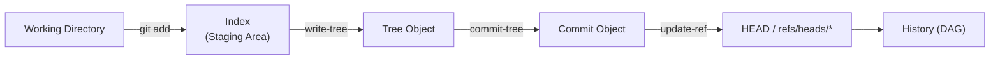
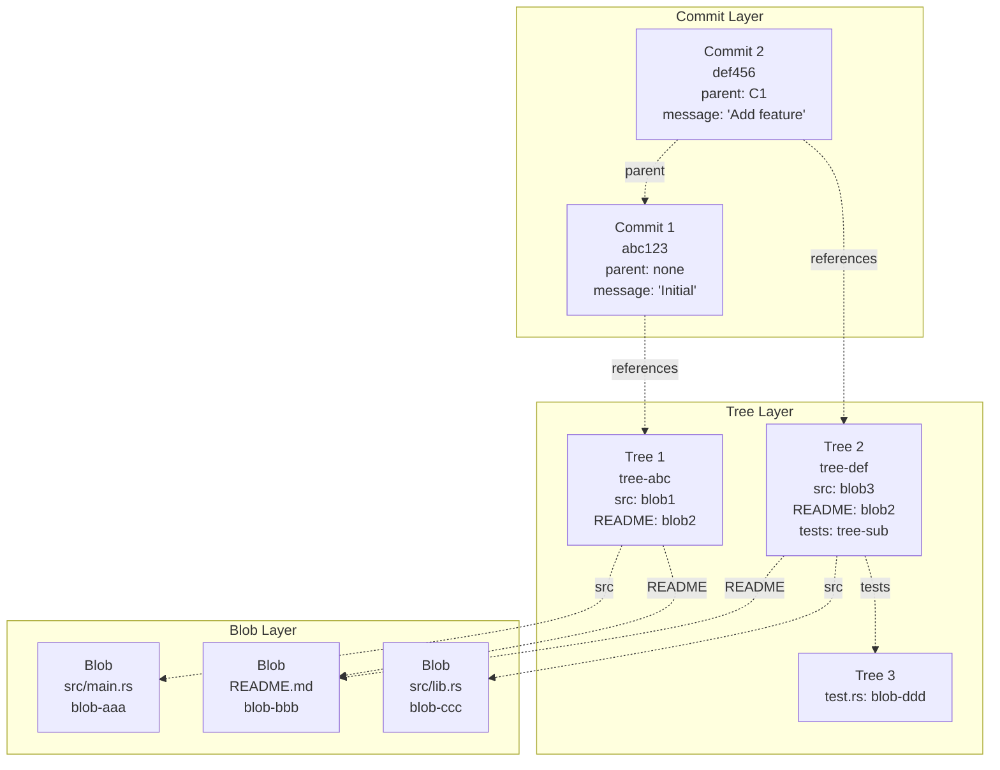

# Commit Objects and the DAG: Phase 4 Documentation

> This document covers the commit object format, the Directed Acyclic Graph (DAG) structure, and the `commit-tree` command implementation in `git-rs`. It is scoped to Phase 4 of the project. Phases 5–6 build upon this model.

---

## 1. The Commit Object: A Snapshot with Context

A commit object is fundamentally different from blob and tree objects. While blobs and trees are **binary** objects whose content is raw bytes, a commit object is **plain text**. It is a human-readable ASCII format containing structured key-value headers.

This design choice — using text instead of binary for commits — makes Git's history easily introspectable. You can read a commit object with `cat -F .git/objects/xx/yyyy...` (after decompression) and understand its entire meaning without any special tools.

### 1.1 The Anatomy of a Commit Object

```text
┌────────────────────────────────────────────────────────────┐
│  COMMIT OBJECT FORMAT                                      │
├────────────────────────────────────────────────────────────┤
│                                                            │
│  tree <40-char-hex-hash>\n                                 │
│  parent <40-char-hex-hash>\n       (optional, 0..N times) │
│  author <name> <email> <unix-timestamp> <timezone>\n        │
│  committer <name> <email> <unix-timestamp> <timezone>\n     │
│  \n                                                         │
│  <commit message text>\n                                    │
│                                                            │
└────────────────────────────────────────────────────────────┘
```

**Key observation:** The commit object contains **no file data**. It only references a tree object (which in turn references blobs). This indirection is powerful — it means multiple commits can point to the same tree if the directory content hasn't changed, and it means the commit hash is independent of the actual content, making it focus purely on *metadata and linkage*.

### 1.2 Field-by-Field Breakdown

| Field | Required | Format | Purpose |
| ------- | ---------- | -------- | --------- |
| `tree` | Yes | `tree <40-hex>` | Points to the root tree object representing the complete directory state at this commit |
| `parent` | No | `parent <40-hex>` | References one or more previous commits. Absent for initial commits, multiple for merges |
| `author` | Yes | `author Name <email> ts tz` | Identifies who wrote the code (the person who authored the patch) |
| `committer` | Yes | `committer Name <email> ts tz` | Identifies who created the commit (may differ from author in cherry-picks, rebases, etc.) |
| `<blank line>` | Yes | `\n` | Separator between headers and message |
| `message` | Yes | Free text + `\n` | Human-readable description of the changes |

### 1.3 The Timestamp and Timezone Fields

The timestamp is a **Unix epoch time** — the number of seconds since January 1, 1970, 00:00:00 UTC. The timezone is expressed in `+HHMM` or `-HHMM` format relative to UTC.

```text
 ┌──────────────┬────────────────────────────┐
 │ 1718000000   │ Timestamp: 2024-06-10      │
 │              │ 14:26:40 UTC                 │
 ├──────────────┼────────────────────────────┤
 │ +0000        │ Offset from UTC            │
 │              │ (0 hours, 0 minutes)         │
 └──────────────┴────────────────────────────┘
```

The timezone offset is preserved (not normalized to UTC) so that tools like `git log` can display the time in the committer's local timezone, providing a more natural reading experience.

---

## 2. The Git DAG: Directed Acyclic Graph

Git stores project history as a **Directed Acyclic Graph (DAG)** — a mathematical structure where each node points to zero or more predecessors, but no cycles exist.

### 2.1 DAG Structure



**Key properties of the Git DAG:**

| Property | Explanation |
| ---------- | ------------- |
| **Directed** | Edges (parent pointers) only go backward in time — from child to parent |
| **Acyclic** | It is impossible to follow parent pointers and loop back to the same commit |
| **Immutable** | Once a commit is created, it never changes. The SHA-1 hash encodes all fields |
| **Content-addressed** | Each commit hash uniquely identifies its entire content |

### 2.2 Why the DAG Matters

The DAG is not just a data structure — it is the **mathematical foundation** of Git's reliability:

1. **History Integrity:** Because each commit includes the hash of its parent, any tampering with history would require changing every subsequent commit's hash. This is computationally infeasible with SHA-1.

2. **Efficient Branching:** A branch is just a mutable pointer to a commit. Creating a branch means writing  bytes to a file, not copying any data.

3. **Reliable Merging:** The DAG structure provides a clear mathematical framework for finding merge bases and combining divergent histories.

4. **Deduplication:** Identical content across different branches or times shares the same blob objects, because the content (not the path or branch) determines the hash.

---

## 3. Commit Object Serialization Pipeline

The process of creating a commit object follows the same content-addressable storage pipeline as blobs and trees, but with a text-based payload:



### 3.1 The Serialization Function

In `git-rs`, the `write_commit` function in `src/commit.rs` performs the following steps:

```rust
fn write_commit(commit: Commit) -> Result<String, Box<dyn std::error::Error>> {
    // Step 1: Build the serialized text buffer
    let mut serialized: Vec<u8> = Vec::new();
    
    // tree header (required)
    serialized.extend_from_slice(format!("tree {}\n", commit.tree).as_bytes());
    
    // parent header (optional, can appear multiple times)
    if let Some(parent_hash) = &commit.parent {
        serialized.extend_from_slice(format!("parent {}\n", parent_hash).as_bytes());
    }
    
    // author header (required)
    serialized.extend_from_slice(
        format!("author {} <{}> {} {}\n",
            commit.author.name,
            commit.author.email,
            commit.author.timestamp,
            commit.author.timezone
        ).as_bytes()
    );
    
    // committer header (required)
    serialized.extend_from_slice(
        format!("committer {} <{}> {} {}\n",
            commit.committer.name,
            commit.committer.email,
            commit.committer.timestamp,
            commit.committer.timezone
        ).as_bytes()
    );
    
    // blank line separator
    serialized.push(b'\n');
    
    // commit message (required, followed by newline)
    serialized.extend_from_slice(format!("{}\n", commit.message).as_bytes());
    
    // Step 2: Store as a commit object (writes to .git/objects/)
    let oid = write_object("commit", &serialized)?;
    Ok(oid)
}
```

**Critical observation:** The `write_object` function (shared with blob and tree objects) prepends the header `commit <size>\0` before computing the SHA-1 and writing to disk. The commit object is therefore stored with the same universal wrapper as all Git objects:

```text
commit <length>\0<serialized-text-content>
```

### 3.2 The Write Object Pipeline (Shared)



---

## 4. The Commit Object Hash: What It Depends On

The SHA-1 hash of a commit object is computed over the **entire serialized content**, including all headers. This means the hash is sensitive to:

| Component | Affects Hash? | Example Difference |
| ----------- | --------------- | ------------------- |
| Tree hash | Yes | Different tree = different commit |
| Parent hash | Yes | Different parent = different commit |
| Author name | Yes | "John" vs "John Doe" |
| Author email | Yes | "<john@a.com>" vs "<john@b.com>" |
| Author timestamp | Yes | Even 1 second difference |
| Author timezone | Yes | +0000 vs +0300 |
| Committer fields | Yes | All committer data |
| Commit message | Yes | Any character change |
| Blank line position | Yes | Missing blank line is a different object |

**Security implication:** Because the hash includes the parent's hash (recursively), changing any commit in history changes every subsequent commit's hash. This is what makes rewriting Git history detectable — the hash chain breaks.

---

## 5. Verification: Reading Commit Objects with Official Git

The ultimate test of `git-rs` is whether official Git can read and parse the objects it creates. For commit objects, the verification command is:

```bash
# Create a commit object using git-rs
./target/release/git-rs commit-tree <tree-hash> -m "Initial commit"
# → abc123def456789abc123def456789abc123def4

# Verify with official Git
git cat-file -p abc123def456789abc123def456789abc123def4

# Expected output:
tree 4b825dc642cb6eb9a060e54bf8d69288fbee4904
author Fady <fady@test.com> 1718000000 +0000
committer Fady <fady@test.com> 1718000000 +0000

Initial commit
```

If official Git produces this output without errors, the commit object format is **mathematically correct**. There is no partial credit — either the byte-for-byte format matches or the SHA-1 hash will not match and Git will reject it.

---

## 6. The Road Ahead: From `commit-tree` to `commit`

`commit-tree` is a **plumbing command** — it creates a commit object but does not update any references. The next phase (Phase 5) introduces the `commit` workflow, which:

1. Reads the index (staging area) to determine what should be committed
2. Calls `write-tree` to create the tree object
3. Calls `commit-tree` to create the commit object with the correct parent
4. Updates `HEAD` (refs/HEAD) to point to the new commit
5. Updates the current branch reference (e.g., `refs/heads/main`)



The `commit-tree` command in `git-rs` used hardcoded author/committer information for simplicity in Phase 4. In Phase 5, this is configurable through Git's standard configuration mechanism (user.name, user.email).

---

## 7. Key Lessons for Systems Programming

Implementing commit objects reinforces several systems programming principles:

### 7.1 Text vs. Binary Protocols

| Aspect | Blob/Tree | Commit |
| -------- | ----------- | -------- |
| Format | Binary | Text (ASCII) |
| Readability | Requires hex dump | Directly readable with `cat` |
| Parsing | Byte-level, careful with offsets | Line-based, string splitting |
| Hash sensitivity | Every byte matters | Every character (and newline) matters |

Git's choice of a text format for commits while using binary for blobs and trees is deliberate. Commits are frequently read by humans and tools, so a text format reduces friction. Blobs and trees are never read directly — they are intermediate data structures.

### 7.2 The Power of Immutability

Once a commit object is written to `.git/objects/`, it is **forever fixed**. This immutability is not just a property of Git — it is its **core safety guarantee**. Because the SHA-1 hash includes all parent hashes, any attempt to modify history would produce a completely different hash, breaking every reference.

The immutability also enables **aggressive caching**. Git can cache the results of any object lookup because objects never change. The filesystem path `.git/objects/xx/yyyy...` is as good as a hash table with perfect collision resistance.

### 7.3 Separation of Concerns

The commit object does not know about branches, tags, or the working directory. It only knows:

- What the directory looked like (tree hash)
- Who authored it and when (author/committer)
- Why it was created (message)
- What its history is (parent hashes)

This separation makes the commit object a **pure data structure** that can be reasoned about independently of any branching model or workflow.

---

## 8. Mermaid Diagram: Complete Phase 4 Object Relationships

This diagram shows how commit objects fit into the complete Git object model after Phase 4:



**Key observations from this diagram:**

- Commit 2 references Commit 1 as its parent, forming the DAG edge
- Both trees reference blob-bbb (README.md) because that file didn't change
- Tree 2 references a subtree (tests/) which itself references a blob
- The structure is immutable — none of these objects can change without changing their hash

---

## 9. Summary

| Concept | What It Is | Why It Matters |
| --------- | ----------- | ---------------- |
| **Commit Object** | Text-based object with key-value headers | Stores snapshot metadata and history links |
| **Tree Reference** | Points to root tree for this snapshot | Separates content (tree/blobs) from metadata (commit) |
| **Parent References** | Zero or more previous commit hashes | Forms the DAG, enables history tracking and branching |
| **Author vs. Committer** | Different people or the same | Distinguishes original authorship from committer action |
| **Timestamp & Timezone** | Unix epoch + UTC offset | Preserves local time context for human readability |
| **Content-Addressing** | SHA-1 of entire serialized commit | Guarantees integrity, enables deduplication |

<div align="center">

---

**Git-RS Phase 4**

*Commit Objects and DAG Parent Linking*

Built for understanding. Verified against official Git.

</div>
