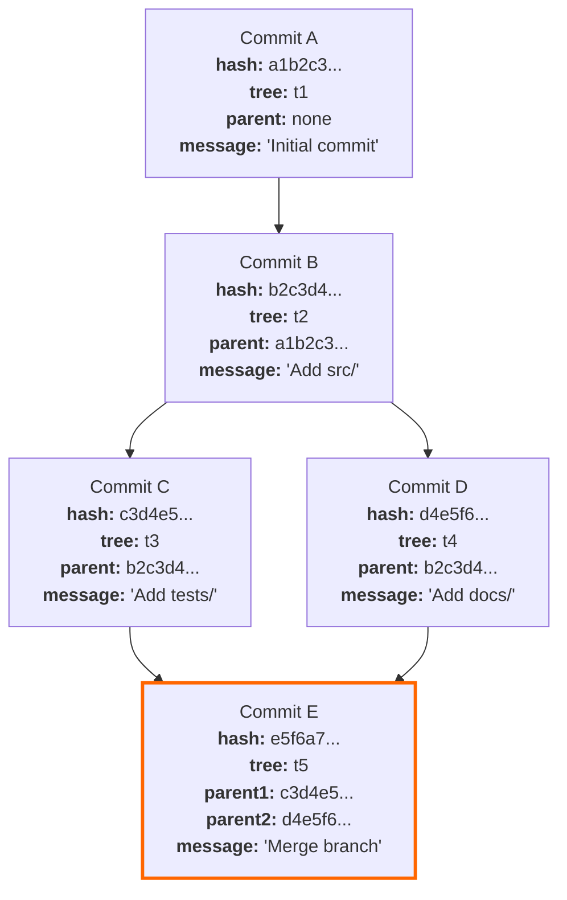
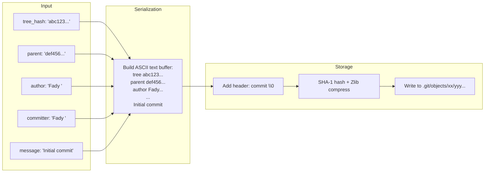
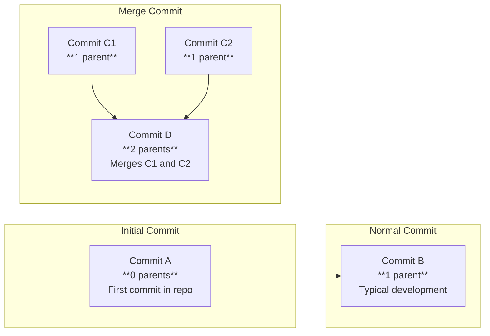
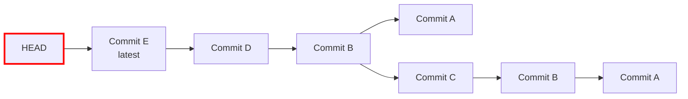
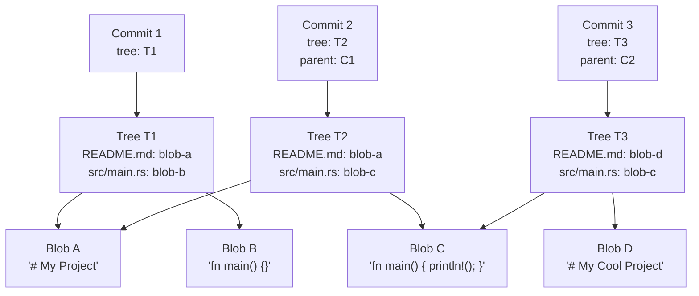

# The Git DAG and Commit Serialization: Deep Dive

> This document provides a detailed exploration of how the Directed Acyclic Graph (DAG) structure enables Git's version control capabilities, and how commit objects are serialized to disk. Companion to `04_commit_object_and_commit_tree.md`.

---

## 1. The DAG as a Mathematical Structure

Git's history is not a simple list — it is a **Directed Acyclic Graph (DAG)**. Understanding this structure is key to understanding why Git handles branching, merging, and history rewriting the way it does.

### 1.1 Formal Definition

A DAG is a pair _(V, E)_ where:

- **V** is a set of vertices (commits)
- **E** is a set of directed edges (parent pointers), where each edge goes from a child commit to its parent commit
- **No cycles exist** — starting from any vertex and following edges, you can never return to the starting vertex

In Git's case:

- Each **vertex** is a commit object, identified by its SHA-1 hash
- Each **directed edge** is a `parent` reference in a commit object
- The graph is **acyclic** because each commit only references earlier commits

### 1.2 DAG Visualization with Mermaid



**Legend:**

- Normal commits are shown with standard styling
- Merge commits (Commit E) have multiple parent pointers and are highlighted in orange
- Each edge represents a `parent` field in the child commit

### 1.3 Why Cycles Are Impossible

In a traditional graph, cycles can form when a node points to one of its descendants. In Git, this is structurally impossible because:

1. **Content-addressing:** A commit's hash includes the hash of all its fields (including parent hashes)
2. **Time moves forward:** The timestamp in each commit is monotonically increasing
3. **Parent references point backward:** By convention, a parent commit always existed before its children

If you tried to create a cycle by manually editing a parent field, the resulting commit would have a completely different hash, making it a different object entirely.

---

## 2. Commit Serialization: Byte-by-Byte

Let's trace through the serialization of a commit object step by step, using the actual `git-rs` implementation.

### 2.1 The Data Structures

```rust
// Signature: who performed the action and when
pub struct Signature {
    name: String,
    email: String,
    timestamp: u64,
    timezone: String,
}

// Commit: a snapshot with context and history
pub struct Commit {
    tree: String,              // 40-char hex hash of root tree
    author: Signature,         // Who wrote the code
    committer: Signature,      // Who created the commit
    message: String,           // Human-readable description
    parent: Option<String>,    // 40-char hex hash of parent commit
}
```

### 2.2 The Serialization Pipeline



### 2.3 The Serialized Bytes

For a commit with the following properties:

- tree: `4b825dc642cb6eb9a060e54bf8d69288fbee4904`
- parent: `def456789abcdef0123456789abcdef01234567`
- author: `Fady <fady@test.com> 1718000000 +0000`
- committer: `Fady <fady@test.com> 1718000000 +0000`
- message: `Initial commit`

The serialized text before hashing is:

```text
tree 4b825dc642cb6eb9a060e54bf8d69288fbee4904
parent def456789abcdef0123456789abcdef01234567
author Fady <fady@test.com> 1718000000 +0000
committer Fady <fady@test.com> 1718000000 +0000

Initial commit
```

**Important details:**

- Each line ends with `\n` (0x0A), including the final line
- The blank line between headers and message is the required separator
- The parent line is optional and can appear multiple times
- `\n` is used, not `\r\n` — Git always uses Unix line endings internally

### 2.4 The Complete Object (Before Storage)

After the header is prepended:

```text
commit 234\0tree 4b825dc642cb6eb9a060e54bf8d69288fbee4904
parent def456789abcdef0123456789abcdef01234567
author Fady <fady@test.com> 1718000000 +0000
committer Fady <fady@test.com> 1718000000 +0000

Initial commit
```

The `<type> <size>\0` header (`commit 234\0`) is added by the shared `write_object` function, just as it does for blobs and trees. This universal wrapper makes all Git objects follow the same storage contract.

---

## 3. Parent References: The Edges of the DAG

Parent references are what transform a flat collection of commits into a meaningful history. Let's explore how they work.

### 3.1 Three Types of Commits by Parent Count



### 3.2 How Parent References Enable History Walking



Given **Commit E**, Git can reconstruct the entire history by following parent pointers:

1. Start at **Commit E** (HEAD)
2. Follow parent → **Commit D**
3. Follow parent → **Commit B**
4. Follow parent → **Commit A** (initial commit, no parent)
   - Also, from B, follow other parent → **Commit C**
   - From C, follow parent → **Commit B**
   - From B, follow parent → **Commit A**

This is how `git log` works — it's simply a traversal of the DAG starting from HEAD and following parent edges.

---

## 4. The Signature Structure: Author vs. Committer

Git distinguishes between **who wrote the code** (author) and **who created the commit** (committer). This distinction matters for:

- **Cherry-picks:** The author stays the same, but the committer is the person applying the cherry-pick
- **Rebases:** Original authorship is preserved, but the rebaser becomes the committer
- **Patches sent by email:** The patch author and the committer may be different people

### 4.1 Signature Serialization Format

```text
<name> <<email>> <unix-timestamp> <timezone-offset>
```

Example:

```text
Fady <fady@test.com> 1718000000 +0000
```

### 4.2 Why Both Author and Committer?

| Scenario | Author | Committer |
| ---------- | -------- | ----------- |
| Normal commit | Alice | Alice |
| Commit applied from patch | Bob (wrote the code) | Alice (applied the patch) |
| Cherry-pick | Alice (original author) | Bob (performed the cherry-pick) |
| Rebase | Alice (original author) | Bob (performed the rebase) |

In `git-rs` Phase 4, author and committer are identical for simplicity. Phase 5 will support reading these from Git configuration or environment variables.

---

## 5. Content Deduplication in the DAG

One of Git's most elegant properties is that **unchanged content is shared across commits**.



Even though there are 3 commits, `blob-a` and `blob-c` are each stored only once because their content hasn't changed. In a project with thousands of commits, this deduplication saves enormous space.

---

## 6. Phase 4 Implementation Summary

The `commit-tree` command in `git-rs` implements the following:

1. **Parses arguments** (tree hash, `-m` flag, message)
2. **Constructs a Commit struct** with hardcoded author info (Phase 5 will make this configurable)
3. **Generates timestamp** using Unix epoch seconds
4. **Serializes the commit** to text with proper line endings
5. **Calls `write_object("commit", ...)`** to hash, compress, store, and return the hash

### 6.1 Command Line Interface

```bash
# Create a commit object from a tree hash
./git-rs commit-tree <tree-hash> -m "Commit message"
```

### 6.2 Expected Output

The command prints the -character hex SHA-1 hash of the newly created commit object:

```sha1
abc123def456789abc123def456789abc123def4
```

This hash can then be used with `git cat-file -p <hash>` for verification.

---

## 7. Verification Checklist

After running `commit-tree`, verify correctness with official Git:

```bash
# 1. Verify the commit exists and is readable
git cat-file -p <commit-hash>

# 2. Verify the hash matches the content
git cat-file -t <commit-hash>
# Expected: commit

# 3. Verify the commit references the correct tree
git cat-file -p <commit-hash> | grep "tree "

# 4. Verify the parent chain (if applicable)
git cat-file -p <commit-hash> | grep "parent "

# 5. Check that the full object hash matches
git rev-parse <commit-hash>
# Should return the same hash
```

---

<div align="center">

---

**Git-RS Phase 4**

_From Tree Snapshots to Historical Context_

Built for understanding. Verified against official Git.

</div>
