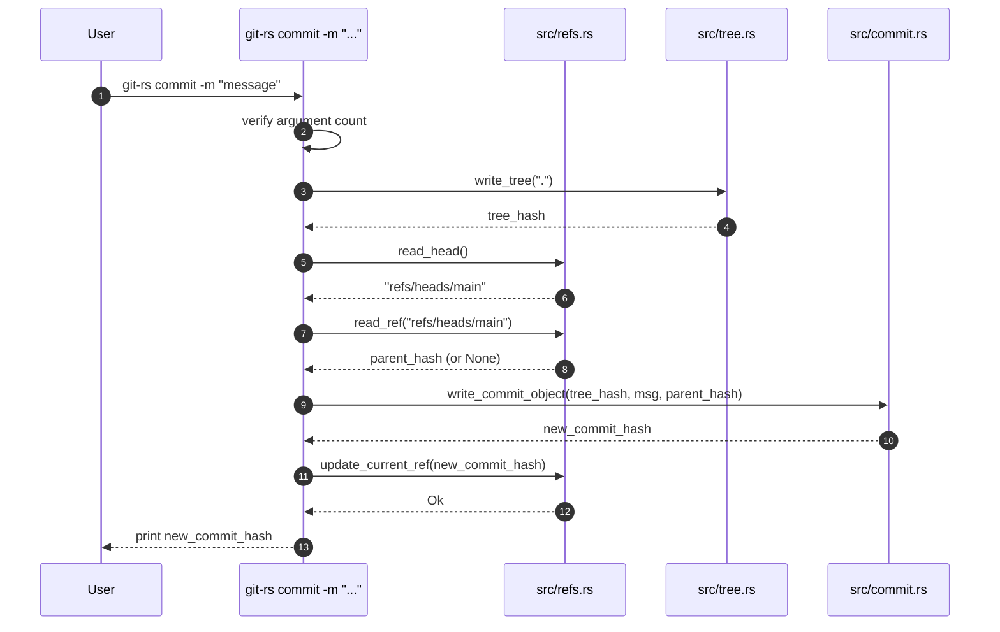
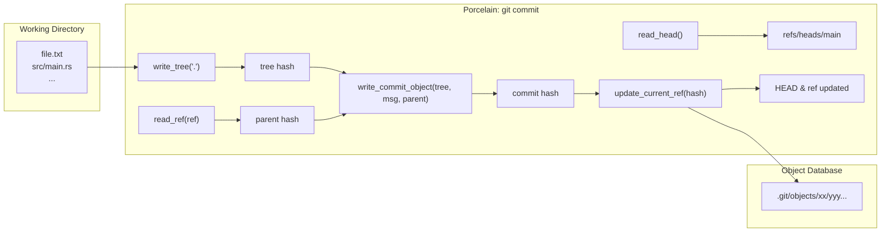

# Phase 5: The `commit` Workflow and Refs Management

> This document covers the porcelain `commit` command and the ref-update machinery (HEAD resolution, branch pointer mutation) introduced in `git-rs` Phase 5. It builds directly on the commit-object and DAG material from [Phase 4](04_commit_object_and_commit_tree.md).

---

## 1. From Plumbing to Porcelain

In Phase 4 we built `commit-tree`, a **plumbing** command: it creates a commit object but leaves all branch bookkeeping to the caller. Real Git users, however, rarely call `git commit-tree` by hand; they type:

```bash
git commit -m "feat: add auth"
```

Phase 5 closes the gap by implementing the `commit` **porcelain** command. Its responsibilities are:

1. Read the current `HEAD` reference to discover which branch is active.
2. Resolve that branch to its current commit hash (the parent of the new commit).
3. Snapshot the working directory into a tree object.
4. Create the commit object with the correct parent pointer and message.
5. Write the new commit hash back to the branch reference, moving the branch tip.

---

## 2. Refs: Git's Mutable Pointers

Git keeps branch state in **refs** — plain text files under `.git/refs/` whose contents are 40-character commit hashes. The HEAD file is a special ref that either:

- Points to a branch: `ref: refs/heads/main`
- Contains a raw commit hash (detached HEAD)

### 2.1 Example `.git` Layout with Refs

```text
.git/
├── HEAD              → "ref: refs/heads/main"
├── objects/
└── refs/
    └── heads/
        └── main      → "a1b2c3d4..." (40-char commit hash)
    └── tags/
        └── v1.0      → "e5f6a7b8..."
```

When you create a new commit on `main`, Git simply overwrites `.git/refs/heads/main` with the new hash. Because commit objects are content-addressed and immutable, this is always safe.

### 2.2 Refs in `git-rs`

The `src/refs.rs` module provides three operations:

| Function | Purpose |
| ---------- | --------- |
| `read_head()` | Parse `.git/HEAD`, fail if detached |
| `read_ref(path)` | Read a `.git/<path>` ref, returning `Option` for missing refs |
| `update_current_ref(hash)` | Write a hash into the branch pointed to by HEAD |

```rust
/// src/refs.rs  (summary)
fn read_head() -> Result<String, Box<dyn Error>> {
    // "ref: refs/heads/main"  →  "refs/heads/main"
}

fn update_current_ref(new_head: &str) -> Result<(), Box<dyn Error>> {
    // resolve HEAD path → write hash + newline
}
```

**Why detached HEAD returns an error:** `read_head()` currently expects the compliant `ref: refs/...` format. If HEAD ever contains a raw hash, it hard-exits. This is a deliberate boundary for Phase 5; detached-HEAD support is a future enhancement.

---

## 3. The `commit` Command Data Flow



---

## 4. Code Walkthrough

### 4.1 `cmd_commit` (entry point)

```rust
fn cmd_commit(commit_message: String) -> Result<String, Box<dyn Error>> {
    // 1. snapshot the current directory into a tree object
    let tree_hash = write_tree(Path::new("."))?;

    // 2. resolve HEAD -> branch name
    let path  = read_head()?;

    // 3. resolve branch name -> current commit hash (parent)
    let ref_content = read_ref(path)?;

    // 4. create commit with the correct parent
    let commit_hash = write_commit_object(tree_hash, commit_message, ref_content)?;
    Ok(commit_hash)
}
```

### 4.2 Wiring in `main.rs`

The CLI dispatcher gains a new arm:

```rust
match args[1].as_str() {
    // ... other commands ...

    "commit" => {
        expect_args(args, 4, "git-rs commit -m <message>");
        let new_commit_hash = cmd_commit(args[3].clone())?;

        // update the branch ref so HEAD points to the new commit
        update_current_ref(&new_commit_hash)?;

        println!("{}", new_commit_hash);
        Ok(())
    }
}
```

Notice the layering:

- `cmd_commit` is **pure** — it creates objects but mutates no refs.
- `update_current_ref` is the **side-effect** — it moves the branch pointer.
- This mirrors real Git, where `git commit` is implemented as a sequence of **plumbing** steps followed by a ref update.

---

## 5. Key Design Decisions

### 5.1 Separation of Plumber and Porcelain

| Layer | File | Responsibility |
| ------- | ------ | ---------------- |
| Plumbing | `src/commit.rs` | Create commit objects (hash, compress, write) |
| Plumbing | `src/tree.rs` | Create tree objects from filesystem |
| Plumbing | `src/refs.rs` | Read/write raw ref files |
| Plumbing | `src/object.rs` | Generic object storage |
| Porcelain | `src/main.rs` | Orchestrate: tree → commit → ref-update |

Keeping the porcelain driver in `main.rs` and the mechanics in domain modules preserves **single-responsibility** and makes each piece independently testable.

### 5.2 The Parent Hash as an `Option<String>`

```rust
pub fn write_commit_object(
    tree_hash: String,
    commit_message: String,
    parent_hash: Option<String>,   // ← None for the first commit
) -> Result<String, Box<dyn Error>>
```

- `Some(hash)` → follow-up commits (attach to the history graph)
- `None` → the very first commit (initial commit, root of the DAG)

This is the same encoding Git itself uses: omit the `parent` header line entirely for the root commit.

### 5.3 Why No Index (Staging Area)?

Phase 5's `commit` snapshots the **entire working directory** on every invocation. A real Git index would let users choose which changes to include. Implementing the index (`git add`, `.git/index`) is a future phase; for now, the simplification keeps the data-flow linear and easy to verify.

---

## 6. Verification

You can verify the Phase 5 behavior with the official `git` CLI:

```bash
# 1. Create a new repo with git-rs
mkdir demo && cd demo
../target/release/git-rs init

# 2. Make the first commit
echo "hello" > file.txt
../target/release/git-rs commit -m "Initial commit"
# → 9c5a...                        (note the hash)

# 3. Ask official Git what the current branch is
git log --oneline
# → 9c5a... Initial commit

# 4. Check that the ref moved
cat .git/refs/heads/main
# → 9c5a...                         (same hash as printed above)
```

If `git log` shows the commit and `git cat-file -p <hash>` displays the correct tree, parent, and author lines, the implementation is byte-for-byte correct.

---

## 7. Mermaid: Complete Commit Lifecycle



---

## 8. Summary

| Concept | Phase 5 Addition | Why It Matters |
| --------- | ---------------- | ---------------- |
| **Refs** | Mutable branch pointers stored in `.git/refs/` | Enable history tracking and branch movement |
| **HEAD** | A symbolic ref pointing to the active branch | Tells Git which branch to update on commit |
| **Porcelain Command** | `commit` wraps plumbing in a user-friendly workflow | Mirrors real Git user experience |
| **Parent Hash Extraction** | Reading the current ref to populate `parent` | Links new commits into the DAG |
| **Ref Update** | Overwriting the branch file with the new commit hash | Moves the branch tip atomically |

**Next up:** Phase 6 will explore `export-snapshot` (a custom command to export the current commit as a portable archive) and integration with an LLM Wiki — bridging the gap between local commit history and external knowledge bases.
