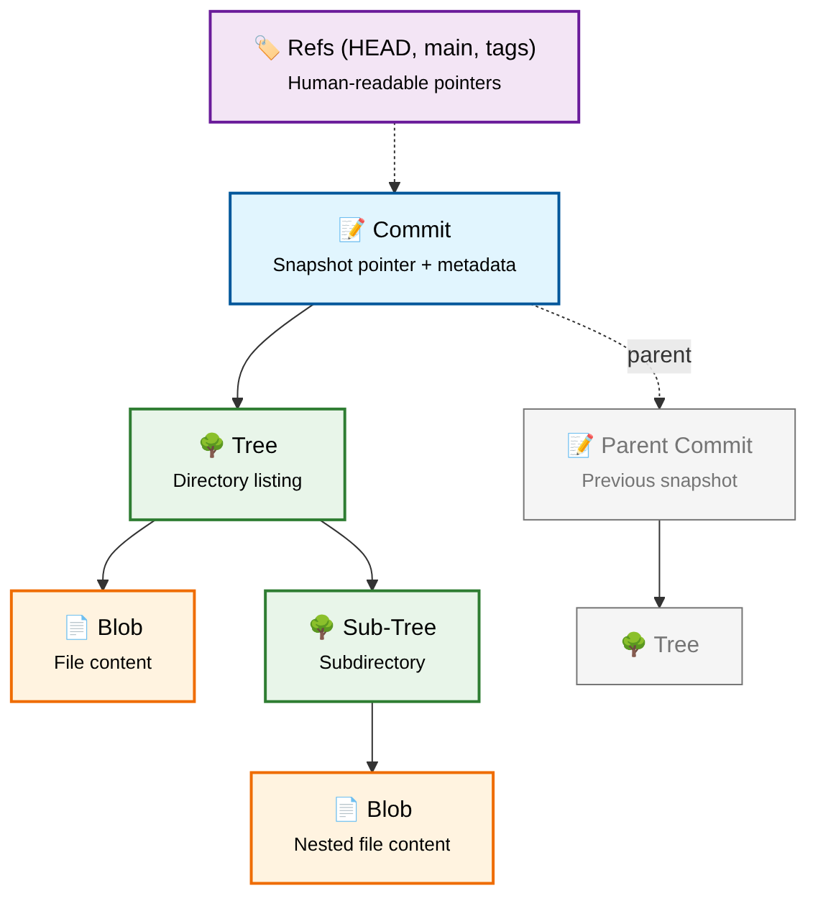
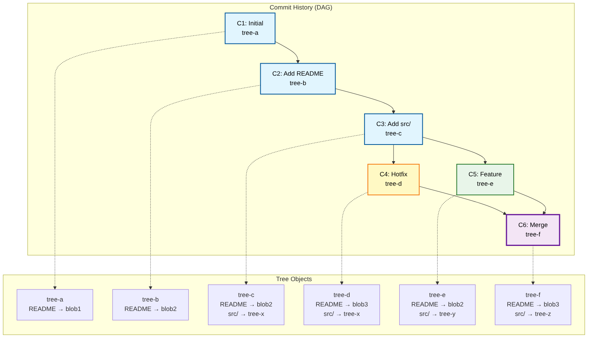
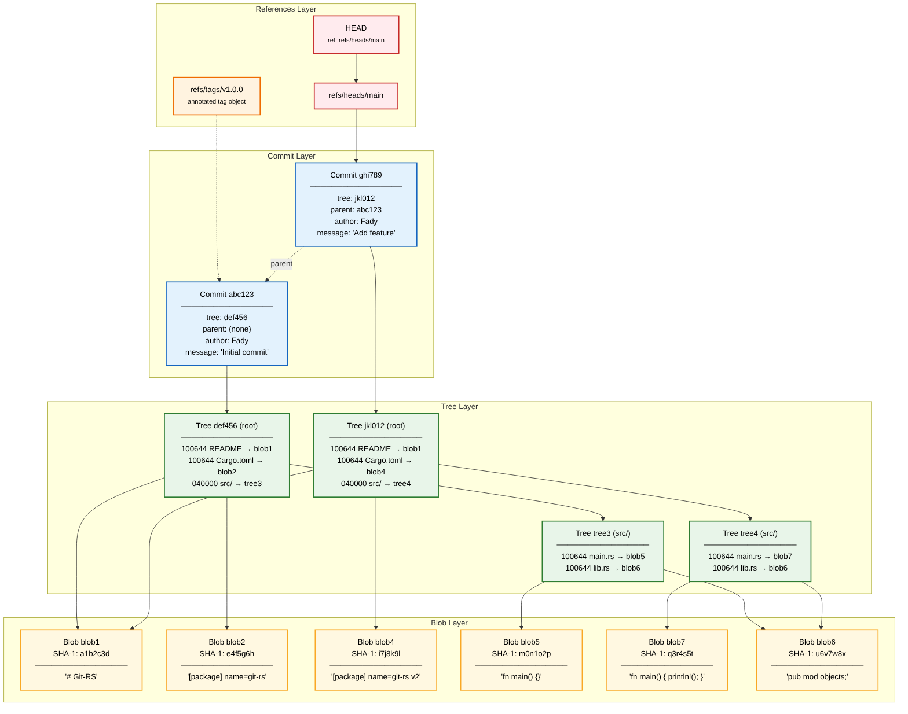
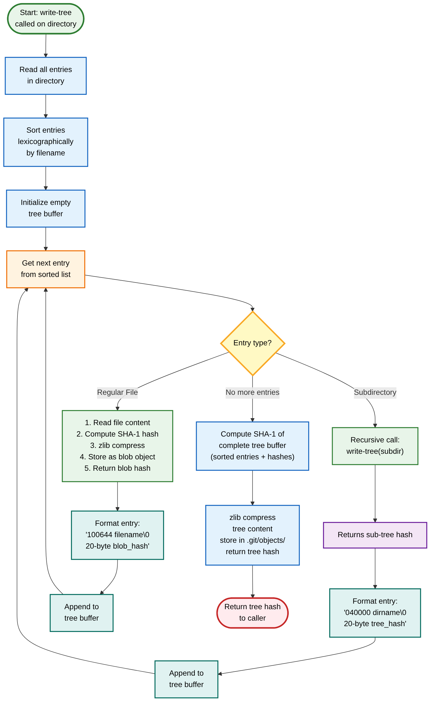
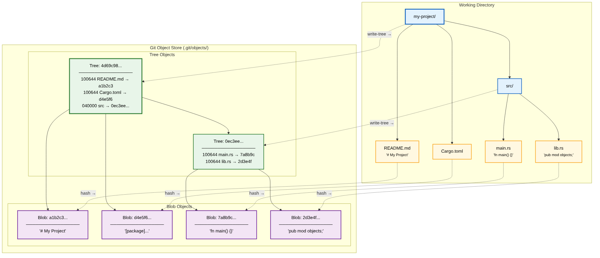
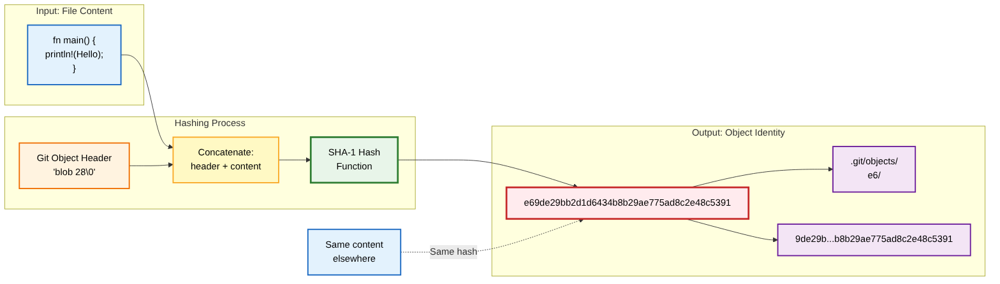
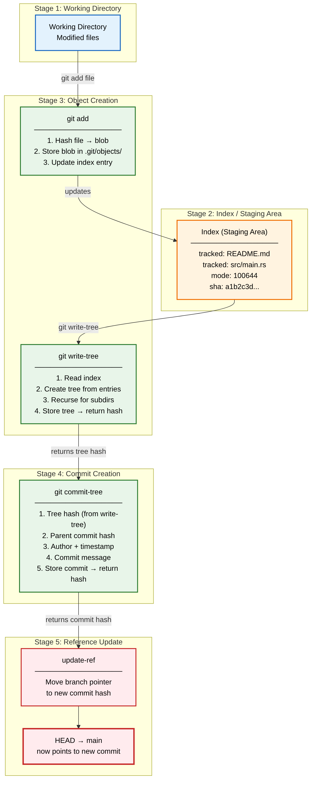

<div align="center">

# **Git-RS**

## Internal Architecture Documentation

*Visual Guide to Git Object Model, DAG Structure, and Write-Tree Algorithm*

**Fady** · June 2025

---

</div>

## Table of Contents

- [1. Git Object Model Overview](#1-git-object-model-overview)
  - [The Four Object Types](#the-four-object-types)
- [2. The Git DAG: Directed Acyclic Graph](#2-the-git-dag-directed-acyclic-graph)
  - [DAG Evolution Across Commits](#dag-evolution-across-commits)
  - [Key Properties of the Git DAG](#key-properties-of-the-git-dag)
- [3. Complete Object Relationships](#3-complete-object-relationships)
  - [References: Human-Readable Entry Points](#references-human-readable-entry-points)
  - [Object Storage Format](#object-storage-format)
- [4. Write-Tree Algorithm Data Flow](#4-write-tree-algorithm-data-flow)
  - [Algorithm Step-by-Step](#algorithm-step-by-step)
  - [Critical Implementation Detail: Sorting](#critical-implementation-detail-sorting)
- [5. Directory-to-Tree Transformation](#5-directory-to-tree-transformation)
  - [The Transformation Process](#the-transformation-process)
  - [Practical Example](#practical-example)
- [6. Content-Addressable Storage](#6-content-addressable-storage)
  - [The Hashing Process](#the-hashing-process)
  - [Benefits of Content Addressing](#benefits-of-content-addressing)
- [7. Complete Commit Creation Flow](#7-complete-commit-creation-flow)
  - [The Five Stages of Commit Creation](#the-five-stages-of-commit-creation)
  - [Practical Verification](#practical-verification)

---

## 1. Git Object Model Overview

Git's architecture is built on a surprisingly simple yet powerful abstraction: **four object types** that form a **Directed Acyclic Graph (DAG)**. Understanding these objects and their relationships is fundamental to understanding how Git stores, retrieves, and versions your code.

At the heart of Git's design is **content-addressable storage**. Every piece of data — whether it's a file's contents, a directory listing, or a commit snapshot — is stored as an object identified by the **SHA-1 hash** of its content. This means identical content always produces the same hash, enabling **automatic deduplication** across the entire repository history.

### High-Level Overview



> **Figure 1:** High-level overview of Git's object model. Commits point to trees, trees reference blobs and other trees, forming a directed acyclic graph. Refs (HEAD, branches, tags) provide human-readable entry points into the graph.

The diagram illustrates the core relationships: a **commit** references a **root tree** that represents the complete project state. That tree, in turn, references **blobs** (file contents) and **sub-trees** (subdirectories). Each commit also links to its **parent commit(s)**, creating the history chain. What makes this structure powerful is that it's **immutable** — once written, an object never changes. This immutability is what makes Git's history reliable and verifiable.

### The Four Object Types

Git defines four fundamental object types that work together to represent your entire project history:

| Object Type | Purpose | Contains | Mode Prefix |
| --- | --- | --- | --- |
| **Blob** | Stores raw file content | File data only (no name, no metadata) | `100644` (regular file) |
| **Tree** | Represents a directory | Sorted list of entries (name → hash mappings) | `040000` (directory) |
| **Commit** | Represents a project snapshot | Tree hash + parent(s) + author + message + timestamp | — |
| **Tag** | Human-readable label to a commit | Tag name + tagger info + message + target commit | — |

**Blob (Binary Large Object)** stores the raw content of a file. Blobs contain only data — no filename, no permissions, no metadata. A blob is purely a snapshot of what a file contained at a specific point in time. The same file content always produces the same blob hash, regardless of where the file appears in the directory structure.

**Tree** represents a directory. A tree object contains a sorted list of entries, where each entry maps a filename to either a blob (for files) or another tree (for subdirectories). Tree entries include file modes (`100644` for regular files, `040000` for directories) and the SHA-1 hash of the referenced object. The sorting is lexicographic by filename and is **critical** for deterministic hashing.

**Commit** represents a snapshot of the project at a specific point in time. A commit object points to a root tree object (the complete directory structure), references zero or more parent commits, and contains metadata including author, committer, timestamp, and commit message. The commit hash is computed from all of these fields combined, making commits tamper-evident.

**Tag** is a human-readable label pointing to a specific commit. **Annotated tags** are themselves objects containing the tagger information, message, and reference to a commit. **Lightweight tags** are simply refs — pointers stored as files under `.git/refs/tags/`.

---

## 2. The Git DAG: Directed Acyclic Graph

Git stores project history as a **Directed Acyclic Graph (DAG)**, a mathematical structure where nodes (commits) are connected by directed edges (parent pointers) such that **no cycles exist**. This design is the foundation of Git's branching and merging capabilities.

In a DAG, each commit node points **backward** to its parent commit(s). An initial commit has no parents; a regular commit has one parent; a **merge commit** has two or more parents. Because edges only point backward in time, you can never follow a chain of parent pointers and loop back to the starting commit — hence the structure is **acyclic**.

### DAG Evolution Across Commits



> **Figure 2:** DAG evolution showing commits (C1–C6), branching, and merging. Each commit references a unique tree object representing the complete project snapshot at that point in time.

The diagram shows how the DAG grows as development progresses. Starting from an **initial commit (C1)**, each new commit adds a node and an edge. When a **branch** occurs, a commit gains multiple children. When branches **merge**, a new commit is created with multiple parents, joining divergent histories back together.

Notice that each commit references a **distinct tree object** — even when only one file changes, a new tree is created because the tree contains the hash of its entries. However, unchanged files share the **same blob objects** across commits. This is the key to Git's storage efficiency.

### Key Properties of the Git DAG

**Immutable History.** Once a commit is created, it never changes. The SHA-1 hash of a commit includes the hash of its tree, parent hashes, and all metadata. Any modification would produce a completely different hash, effectively creating a new commit rather than altering the existing one. This immutability guarantees that history cannot be silently tampered with.

**Content Deduplication.** Because objects are content-addressed, identical files across different commits or branches share the same blob object. Git only stores a file's full content once, even if it appears in thousands of commits. This makes Git remarkably space-efficient despite storing **complete snapshots** rather than deltas.

**Efficient Branching.** A branch in Git is simply a **mutable pointer to a commit**. Creating a branch requires only writing a 40-character hash to a file — no copying of data, no duplication of history. This is why Git branches are lightweight and instantaneous, unlike traditional version control systems that copy entire directory trees.

**Reliable Merging.** The DAG structure provides a clear mathematical framework for merging. Git can find the **common ancestor (merge base)** of any two commits by walking the DAG, and the merge algorithm uses this information to combine changes correctly. The DAG ensures that merge operations have well-defined semantics.

---

## 3. Complete Object Relationships

This section presents a **comprehensive view** of Git's object model, showing all relationships between the four object types, the references layer, and how they interconnect to form a complete version control system. This detailed diagram reveals the full complexity of Git's storage architecture.

The diagram is organized into **four conceptual layers**: the **References Layer** at the top provides human-readable entry points; the **Commit Layer** contains snapshot metadata; the **Tree Layer** represents directory structures; and the **Blob Layer** stores actual file content. Each layer depends on the layers below it, creating a strict hierarchy of dependencies.



> **Figure 3:** Comprehensive object relationship diagram showing all four object types across four conceptual layers. Solid arrows indicate direct references (stored within the object); dashed arrows indicate the parent commit chain.

In this example, two commits are shown: the **initial commit (abc123)** with no parent, and a **second commit (ghi789)** that has the first commit as its parent. Both commits reference their respective root trees, which in turn reference blobs and sub-trees. Notice how the unchanged `lib.rs` file (blob6) is **shared** between both commits' tree structures — this is content deduplication in action.

### References: Human-Readable Entry Points

The SHA-1 hashes that identify Git objects are cryptographically secure but human-unfriendly. **References** provide memorable names for specific commits:

| Reference Type | Location | Mutable? | Purpose |
| --- | --- | --- | --- |
| **HEAD** | `.git/HEAD` | Yes | Points to current branch (or commit in detached state) |
| **Branch** | `.git/refs/heads/*` | Yes | Advances automatically with new commits |
| **Tag (lightweight)** | `.git/refs/tags/*` | No | Static pointer to a commit |
| **Tag (annotated)** | `.git/refs/tags/*` + object | No | Full object with metadata |
| **Remote refs** | `.git/refs/remotes/*` | Yes | Tracks remote branch state |

**HEAD** is a special reference that points to the currently checked-out commit. Usually HEAD contains a symbolic reference like `ref: refs/heads/main`, meaning it points to the main branch. In a **detached HEAD state**, HEAD directly contains a commit hash.

**Branches** (`refs/heads/*`) are mutable pointers that advance automatically when new commits are made. The `main` branch is simply a file containing the hash of the latest commit on that line of development.

**Tags** (`refs/tags/*`) are fixed pointers to specific commits. **Annotated tags** are full objects containing tagger information, a message, and a reference to a commit. **Lightweight tags** are simply refs — plain text files containing a commit hash.

### Object Storage Format

Every Git object is stored as a compressed file in `.git/objects/`. The storage format is consistent across all object types:

```Text
<object_type> <content_length>\0<content>
```

This entire string is **zlib-compressed** and written to a file whose path is derived from the SHA-1 hash of the **uncompressed** content. The first two characters of the hash form the directory name, and the remaining 38 characters form the filename:

```Tree
.git/objects/
├── ab/
│   └── c123... (commit object)
├── e6/
│   └── 9de2... (blob object)
└── de/
    └── f456... (tree object)
```

This structure distributes objects across 256 (`00`–`FF`) directories, preventing any single directory from containing too many files — a practical optimization for filesystem performance.

---

## 4. Write-Tree Algorithm Data Flow

The `write-tree` command is one of Git's **core plumbing commands**. It takes the contents of the index (staging area) and creates a tree object from it, returning the hash of that tree. Understanding this algorithm is essential for understanding how Git snapshots directory structures.

The algorithm is **inherently recursive**: to create a tree for a directory, you must first create trees for all subdirectories. The **base case** is a directory containing only files — these are hashed directly into blobs. The **recursive case** handles subdirectories by calling `write-tree` on each subdirectory and including the resulting tree hash in the parent tree's entries.



> **Figure 4:** Complete data flow of the write-tree algorithm. The process reads directory entries, sorts them lexicographically, and recursively processes subdirectories before constructing the parent tree object.

### Algorithm Step-by-Step

The write-tree algorithm executes the following steps in order:

1. **Read Directory Entries.** Scan the target directory and collect all entries (files and subdirectories). The `.git` directory is always excluded from this scan. Hidden files and directories may or may not be included depending on the specific implementation and configuration.

2. **Sort Entries.** Sort all entries **lexicographically by filename**. This sorting is critical — it ensures that the same directory always produces the same tree hash, regardless of the order in which the filesystem returns entries. Without sorting, tree hashes would be non-deterministic.

3. **Process Each Entry.** For each entry in sorted order, determine its type. Regular files are hashed as **blob objects** (read content → compute SHA-1 → zlib compress → store). Subdirectories trigger a **recursive call** to `write-tree`, which returns the subtree's hash.

4. **Format Tree Entries.** Each entry is formatted as:

   ```Text
   <mode> <filename>\0<20-byte binary hash>
   ```

   The mode is `100644` for regular files and `040000` for directories. The null byte (`\0`) separates the textual header from the binary hash.

5. **Compute Tree Hash.** Concatenate all formatted entries and compute the SHA-1 hash of:

   ```Text
   tree <total_length>\0<concatenated_entries>
   ```

6. **Store and Return.** Compress the tree content with zlib and write it to `.git/objects/XX/YYYY...` where `XX` is the first two characters of the hash. Return the full hash to the caller.

### Critical Implementation Detail: Sorting

The **lexicographic sorting** of tree entries is not merely a convenience — it is **essential** for Git's content-addressed model to work.

Consider a directory containing files `a.txt` and `b.txt`. If the filesystem returns them in order `['b.txt', 'a.txt']`, and we process them without sorting, the resulting tree buffer will be different from processing them as `['a.txt', 'b.txt']`. Different buffers produce different SHA-1 hashes, which means the **same directory content would appear as different objects** depending on filesystem behavior.

By sorting entries before hashing, Git ensures **deterministic, platform-independent tree hashes**. This property is fundamental to Git's distributed nature — every repository, on every platform, must compute the same hash for the same content.

There is also a subtle but important detail: entries are sorted **as byte strings**, not as Unicode strings. This means the sorting order depends on the raw byte values of the filenames, which affects how non-ASCII filenames are ordered.

---

## 5. Directory-to-Tree Transformation

This section visualizes the transformation from a **working directory** on your filesystem to the corresponding **Git objects** stored in `.git/objects/`. This mapping is the core of how Git captures and preserves project state.

The transformation is **lossless** in the sense that every file becomes a blob containing its exact contents, and every directory becomes a tree containing references to its contents. However, it is also **structural** — filenames live in trees, not blobs, which means **renaming a file produces a new tree but reuses the existing blob** (since the content hasn't changed).



> **Figure 5:** Visual mapping from working directory (left) to Git object store (right). Each file becomes a blob; each directory becomes a tree. Dashed arrows show the correspondence between filesystem entries and their Git object representations.

### The Transformation Process

When you run `git add` followed by `git write-tree`, Git performs the following transformation on your working directory:

**Files Become Blobs.** Each regular file is read, prefixed with a header (`blob <size>\0`), and hashed with SHA-1. The content is zlib-compressed and stored in `.git/objects/`. The filename is **not part of the blob** — only the content matters. This is why two files with the same content in different directories share the same blob object.

**Directories Become Trees.** Each directory becomes a tree object containing one entry per child (file or subdirectory). Each entry contains the mode, name, and SHA-1 hash of the corresponding blob or subtree. A directory with 10 files will produce a tree object with 10 entries.

**Root Directory Becomes Root Tree.** The top-level directory of the project becomes the **root tree**, which is referenced directly by a commit object. This root tree, through its recursive structure of sub-trees and blobs, contains a **complete snapshot** of the entire project at a specific point in time.

### Practical Example

Consider a project with the following structure:

```tree
my-project/
├── README.md          # content: "# My Project"
├── Cargo.toml         # content: "[package] name = \"git-rs\""
└── src/
    ├── main.rs        # content: "fn main() {}"
    └── lib.rs         # content: "pub mod objects;"
```

After `git add .` and `git write-tree`, the following objects are created:

| Object | Hash (short) | Type | What It Contains |
| --- | --- | --- | --- |
| `README.md` content | `a1b2c3...` | **Blob** | `"# My Project"` |
| `Cargo.toml` content | `d4e5f6...` | **Blob** | `"[package] name = \"git-rs\""` |
| `main.rs` content | `7a8b9c...` | **Blob** | `"fn main() {}"` |
| `lib.rs` content | `2d3e4f...` | **Blob** | `"pub mod objects;"` |
| `src/` directory | `0ec3ee...` | **Tree** | `main.rs → 7a8b9c...`, `lib.rs → 2d3e4f...` |
| `my-project/` root | `4d69c98...` | **Tree** | `README.md → a1b2c3...`, `Cargo.toml → d4e5f6...`, `src/ → 0ec3ee...` |

The tree hash `4d69c98...` returned by `write-tree` is the hash of the **root tree**. A commit object would then point to this root tree, creating a permanent snapshot of the entire project.

---

## 6. Content-Addressable Storage

**Content-addressable storage** is the foundational concept that makes Git's architecture possible. Instead of identifying files by their location or name, Git identifies every piece of data by the **cryptographic hash of its content**. This simple idea has profound implications for how Git stores, deduplicates, and verifies data.

Git uses **SHA-1** (Secure Hash Algorithm 1) to compute 160-bit hashes, represented as 40-character hexadecimal strings. While SHA-1 is no longer considered secure for cryptographic purposes against intentional attacks, it remains perfectly suitable for Git's use case of content addressing and integrity verification. The probability of an **accidental hash collision** is astronomically low — effectively zero for all practical purposes.



> **Figure 6:** The content-addressable storage mechanism. File content is prefixed with a type header, hashed with SHA-1, and stored at a path derived from the hash. Identical content always produces the same hash, enabling automatic deduplication.

### The Hashing Process

When Git stores an object, it follows a precise algorithm:

1. **Prepare Content.** Read the raw content of the file (for blobs) or construct the content (for trees, commits, and tags).

2. **Add Header.** Prefix the content with a header indicating the object type and size: `<type> <size>\0`. For example, a blob containing `hello` would have the header `blob 5\0`.

3. **Compute Hash.** Calculate the SHA-1 hash of the entire string (header + content). This 40-character hex string becomes the object's unique identifier.

4. **Compress.** Compress the entire string using **zlib compression**. This typically reduces storage size by 50–80% for text files.

5. **Store.** Write the compressed data to `.git/objects/XX/YYYYYYYYYYYYYYYYYYYYYYYYYYYYYYYYYYYYYYYY`, where `XX` is the first two characters of the hash and `YYYY...` is the remaining 38 characters.

### Benefits of Content Addressing

| Benefit | Description |
| --- | --- |
| **Automatic Deduplication** | If two files have identical content, they produce the same hash and share the same storage. Git stores the content only once, regardless of how many times it appears. |
| **Integrity Verification** | Because the hash is computed from the content, any corruption or tampering would produce a hash mismatch. Git can detect data corruption by recomputing hashes. |
| **Efficient Comparison** | To check if two files are identical, Git compares their hashes rather than their contents — comparing two 40-character strings instead of potentially megabytes of data. |
| **Fast Lookup** | Given a hash, Git can locate the corresponding object in O(1) time using the two-character directory prefix. |

---

## 7. Complete Commit Creation Flow

This final section presents the **end-to-end data flow** from modified files in the working directory to a permanent commit in the Git repository. Understanding this complete pipeline ties together all the concepts from previous sections and shows how Git's individual components work together to create a versioned snapshot.

The commit creation process is divided into **five distinct stages**, each transforming data from one representation to another. This pipeline is the essence of what happens when you run `git commit` — Git's porcelain commands (`add`, `commit`) are simply convenient wrappers around these fundamental plumbing operations.



> **Figure 7:** End-to-end data flow from working directory to committed snapshot. Five stages transform modified files through the index, object creation, commit assembly, and reference update to produce a permanent entry in the repository history.

### The Five Stages of Commit Creation

**Stage 1 — Working Directory.** This is where you edit files using your preferred editor. The working directory contains the actual files you work with, in their uncompressed, human-readable form. Git considers these files in one of four states: **untracked**, **modified**, **staged**, or **committed**.

**Stage 2 — Index (Staging Area).** When you run `git add`, Git computes the blob hash of the file's content, stores the blob in `.git/objects/`, and adds an entry to the **index**. The index is a binary file (`.git/index`) that maps filenames to blob hashes, acting as a **proposed next tree**. It allows you to selectively choose which changes to include in the next commit.

**Stage 3 — Object Creation.** Running `git write-tree` reads the index and constructs tree objects from it, producing a **root tree hash**. If any entries in the index reference directories, `write-tree` recursively creates the necessary subtree objects. This stage transforms the flat index into a **hierarchical tree structure**.

**Stage 4 — Commit Creation.** The `git commit-tree` command takes the tree hash from `write-tree`, adds parent commit hash(es), author/committer information with timestamps, and the commit message. It hashes this content as a commit object and stores it, returning the commit hash.

**Stage 5 — Reference Update.** Finally, `git update-ref` moves the current branch pointer to the new commit hash. HEAD is updated to point to this branch, and the commit is now a **permanent part of the repository history**, accessible by its hash or through the branch reference.

### Practical Verification

You can observe this entire pipeline manually using Git's **plumbing commands**. Start with a clean repository, create or modify files, then run each plumbing command individually:

```bash
# 1. Stage a file
git update-index --add README.md

# 2. Create the tree (returns tree hash)
TREE_HASH=$(git write-tree)

# 3. Create the commit (returns commit hash)
COMMIT_HASH=$(echo "Initial commit" | git commit-tree $TREE_HASH)

# 4. Move the branch pointer to the new commit
git update-ref refs/heads/main $COMMIT_HASH

# 5. Update HEAD to point to the branch
git symbolic-ref HEAD refs/heads/main
```

This exercise reveals that Git's porcelain commands (`git add`, `git commit`) are simply **convenient wrappers** around these fundamental operations. Understanding the plumbing gives you complete control over Git's internals and deep insight into how the system works under the hood.

<div align="center">

---

**Git-RS**

*A from-scratch Git implementation in Rust*

Built for understanding. Designed for reliability.

</div>
